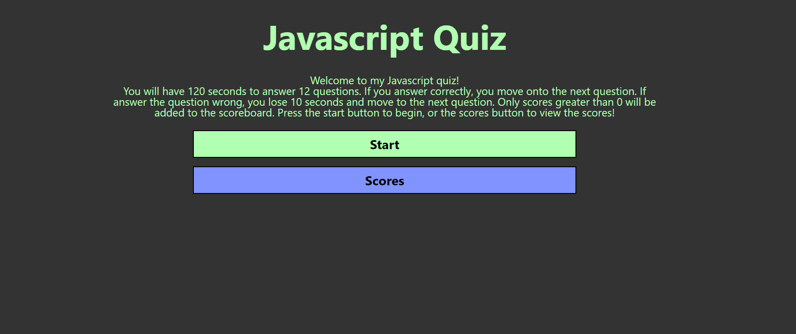

# Javascript Quiz

## Description

A Javascript quiz with 12 questions. At the end, you can enter your initials an it will put your remaining time and initials on a local scoreboard. A funny cat will appear if you get all the questions right.

## Installation

Nothing special is needed to install. It's just an HTML, CSS, Javascript, and some picture assets.

## Usage

You can view the published webpage [here](https://spawze.github.io/JavaScript-Quiz/)  

Click start, or scores to view the scores. When you click start, the quiz and timer will start. At the end, you will be prompted for your initials, and when you submit them it will save them locally.

## Credits

N/A

## License

MIT License

Please See License file in the repository.
